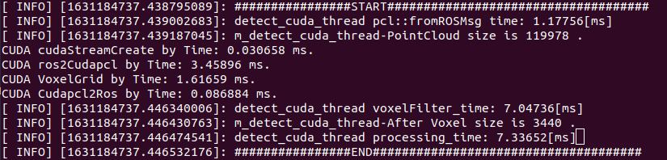
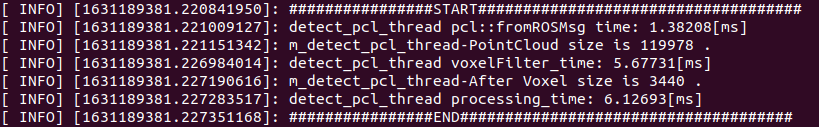
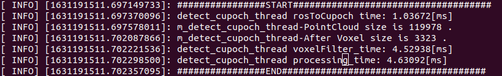

# ga_points_downsampler

ros package points downsampler with cupoch.

optimized with jetson.


## performance in jetson

### 110k points

tested in jetson xavier, jetpack 4.5.1

downsample a pointcloud of 119978 points with res=1.0 to 3440 points.

the bandwidth is 14.4MB/s with 10*1.44MB

- cuda-pcl

7ms



- pcl

6ms



- cupoch

4ms



## build

```sh

```

## performance tunning with jetson

**NOTE:** You should set power management policy for cpu and gpu to get the best performance of `cudaMemCpy`.
### cpu frequency scaling

refer to [this guide from stackoverflow](https://askubuntu.com/questions/523640/how-i-can-disable-cpu-frequency-scaling-and-set-the-system-to-performance) to disable cpu scaling.

```sh
sudo apt-get install cpufrequtils
# to get the highest freq
sudo cpufreq-set -g performance
```

```sh
# to get the default mode powersave
sudo cpufreq-set -g powersave
```

### gpu frequency scaling

refer to [this guide](https://elinux.org/Jetson/AGX_Xavier_Performance_Governor) for more details.

```sh
# If not, please set CONFIG_DEVFREQ_GOV_PERFORMANCE=y and update the kernel
zcat /proc/config.gz | grep CONFIG_DEVFREQ_GOV_PERFORMANCE
# Run below command on board as root to keep GPU alive (not suspend)
echo 0 > /sys/devices/17000000.gv11b/railgate_enable
# Enable performance governor for GPU
cat /sys/class/devfreq/17000000.gv11b/available_governors
echo performance > /sys/class/devfreq/17000000.gv11b/governor
cat /sys/class/devfreq/17000000.gv11b/governor
```
